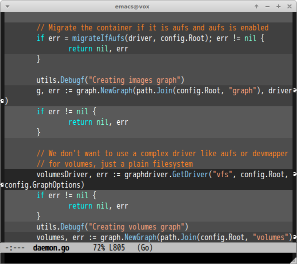

# smeargle.el [![melpa badge][melpa-badge]][melpa-link] [![melpa stable badge][melpa-stable-badge]][melpa-stable-link]

Highlighting regions by last updated time.
Older updated region is highlighted whity, newer region is highlighted blackly.

This is Emacs port of Vim's [smeargle](https://github.com/FriedSock/smeargle)

## Screenshot




## Installation

`smeargle` is available on [MELPA](https://melpa.org/) and [MELPA stable](https://stable.melpa.org/)

You can install `smeargle` with the following command.

<kbd>M-x package-install [RET] smeargle [RET]</kbd>


## Support VCS

- [Git](http://git-scm.com/)
- [Mercurial](http://mercurial.selenic.com/)

## Command

#### `M-x smeargle`

Highlight regions by last updated time.

#### `M-x smeargle-commits`

Highlight regions by age of changes.


#### `M-x smeargle-clear`

Clear overlays in current buffer


## Customize

You can set highlighted colors of `smeargle` by changing `smeargle-colors`.
For example

```lisp
(custom-set-variables
 '(smeargle-colors '((older-than-1day   . "red")
                     (older-than-3day   . "green")
                     (older-than-1week  . "yellow")
                     (older-than-2week  . nil)
                     (older-than-1month . "orange")
                     (older-than-3month . "pink")
                     (older-than-6month . "cyan")
                     (older-than-1year . "grey50"))))
```

If `color` parameter is `nil`, that part is not highlighted.

And you can also set colors of `smeargle-commits` by `smeargle-age-colors`.

```lisp
(custom-set-variables
 '(smeargle-age-colors '((0 . nil)
                         (1 . "grey80")
                         (2 . "grey70")
                         (3 . "grey60")
                         (4 . "grey50")
                         (5 . "grey40")
                         (6 . "grey30")
                         (7 . "grey20")
                         (8 . "grey10"))))
```

You can specify parameters until `smeargle-age-threshold`. `age` is set
to `smeargle-age-threshold` if actual age of changes is older than
`smeargle-age-threshold`. Default value of `smeargle-age-threshold` is 7.


## Sample Configuration

```lisp
(global-set-key (kbd "C-x v s") 'smeargle)
(global-set-key (kbd "C-x v c") 'smeargle-commits)

;; Highlight regions at opening file
(add-hook 'find-file-hook 'smeargle)

;; Updating after save buffer
(add-hook 'after-save-hook 'smeargle)
```

[melpa-link]: https://melpa.org/#/smeargle
[melpa-stable-link]: https://stable.melpa.org/#/smeargle
[melpa-badge]: https://melpa.org/packages/smeargle-badge.svg
[melpa-stable-badge]: https://stable.melpa.org/packages/smeargle-badge.svg
